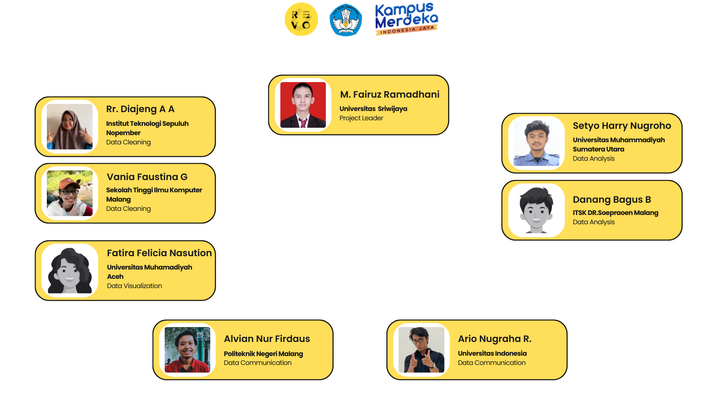
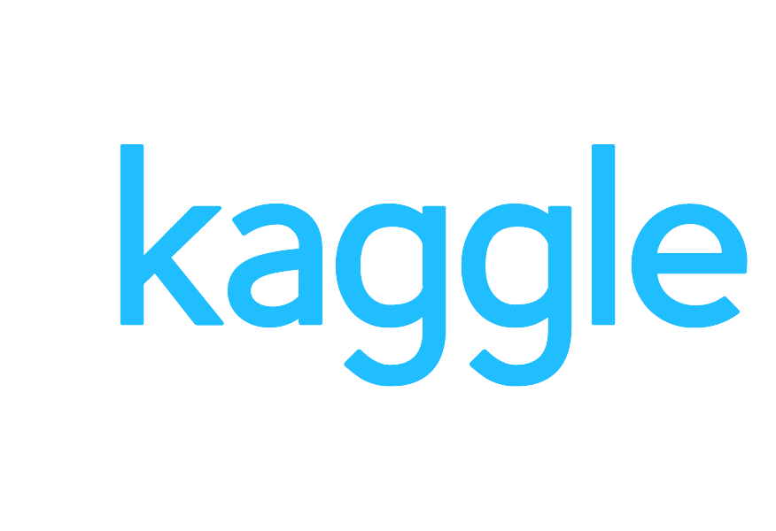
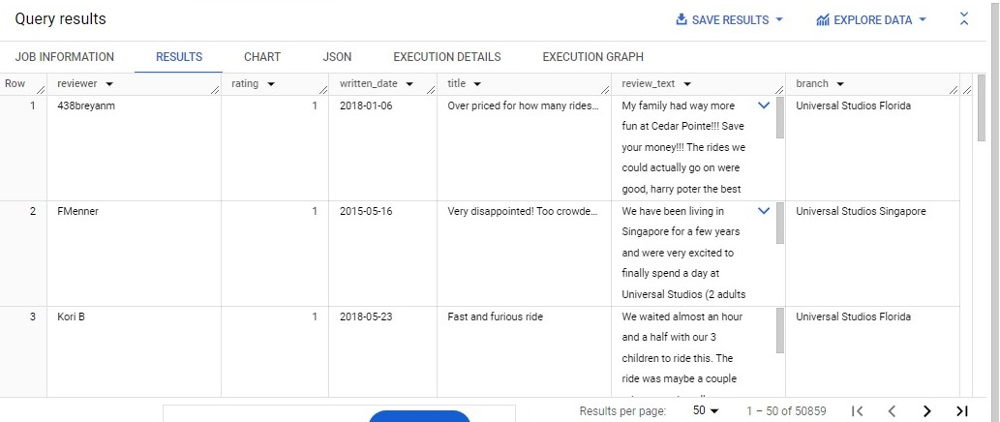
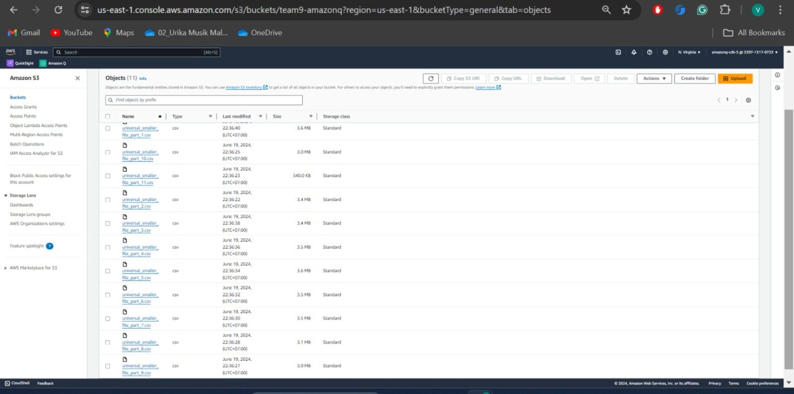
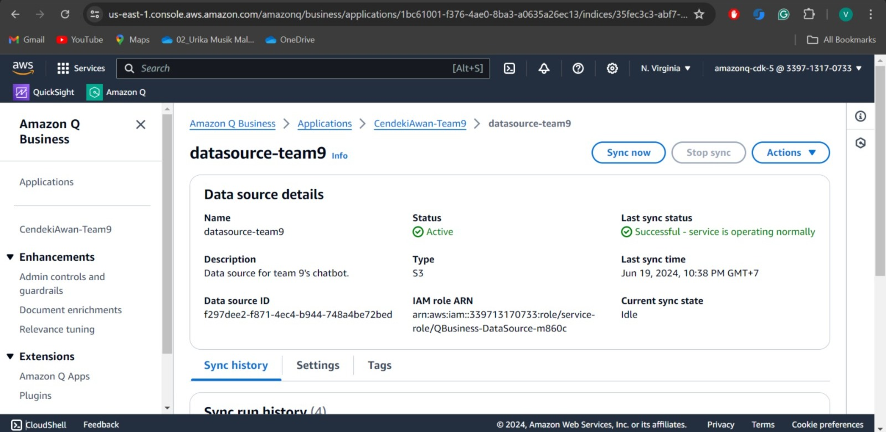
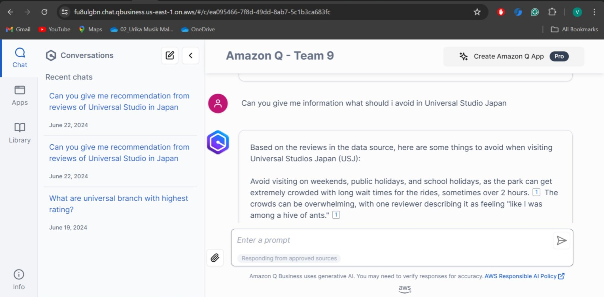
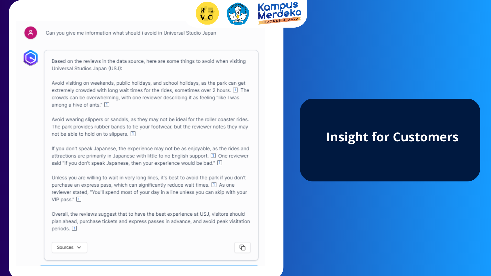
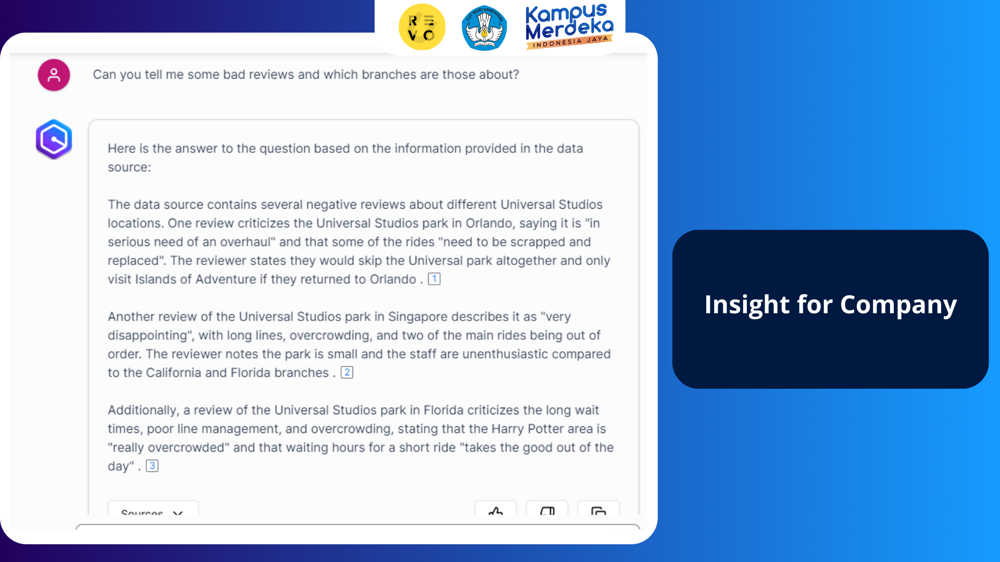
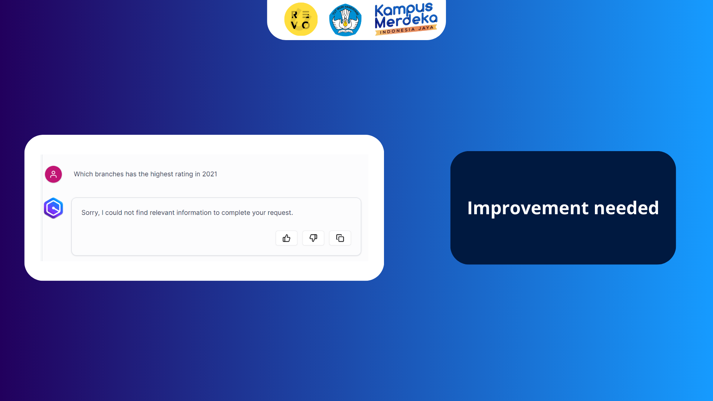
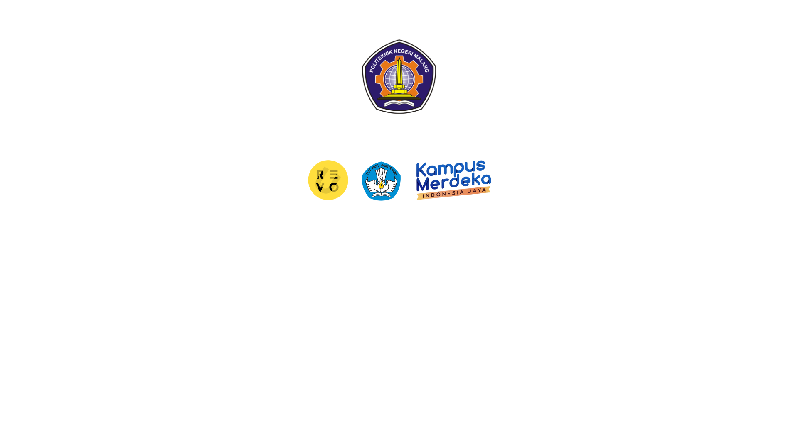

# Advance-Project-KM-Revou

## Dokumentasi Advance Project Kampus Merdeka Studi Independen <p> AWS Cloud Data Engineer And Gen AI Track Powered By RevoU

### Berikut adalah anggota tim 9 KM Cendekiawan RevoU
<p>

<br></br>

----------

### Tentang Advance Project
- Universal Studio Dataset consist of 50.860 reviews (kami menggunakan dataset universal studio yang berisi tentang review2 sebanyak 50.860 review)
- Universal Studio has 3 branches (Florida, Singapore, and Japan) (dimana universal studio sendiri memiliki 3 cabang ada di Florida, Singapore, dan Jepang)
- Chatbot that can help customers and company (tujuan dibentuknya chatbot agar dapat membantu customers dan company universal studio)
- Using amazon q (menggunakan amazon q)
Exp: kami menggunakan universal studio dataset yang terdiri dari 50.860 review dimana terdiri dari 3 cabang yaitu di Florida, Singapore, dan Jepan. Dataset tersebut kami gunakan untuk membuat chatbot yang dapat membantu customers dan universal studio itu sendiri, dengan menggunakan amazon Q

Salah satu contoh chatbot dapat membantu customers dan company<p>
Kemudahan Akses Informasi
-	Sebagai pemilik bisnis = dapat mengumpulkan data dari review dan rating untuk memahami kebutuhan dan preferensi pelanggan (agar bisa upgrade menjadi lebih baik lagi – product dan layanan)
-	Sebagai customer = mendapatkan informasi dengan mudah tentang rating, review, detail review, bahkan detail acara tanpa mencari secara manual (membantu dalam pengambilan keputusan – detail pengalaman baik dan buruk pengunjung lain, memberikan rekomendasi)

----------------

### Data Gathering

Universal Studio mendapat banyak sekali ulasan dari pengunjung. Memeriksa semua ulasan bisa menjadi pekerjaan yang membosankan. Kami harus mengkategorikan ulasan yang diberikan. Ini dapat digunakan untuk sistem manajemen ulasan. Kami menentukan ulasan keseluruhan berdasarkan komentar masing-masing. Jadi perusahaan bisa mendapatkan gambaran lengkap tentang ulasan yang diberikan pengunjung dan dapat menangani bidang-bidang tertentu tersebut. Ini membuat pengunjung lebih loyal terhadap perusahaan, meningkatkan bisnis, ketenaran, nilai merek, dan juga laba.

Dataset mencakup 50.000++ ulasan tentang 3 cabang Universal Studios (Florida, Singapura, Jepang), yang diposting oleh pengunjung di situs web Trip Advisor.

**Deskripsi kolom:**

- pengulas - nama akun pengulas
- rating - penilaian dari pengulas, dari 1 (tidak puas) hingga 5 (puas)
- written_date - tanggal peninjauan
- judul - judul ulasan
- review_text - ulasan yang dibuat oleh pengunjung
- cabang - lokasi Universal Studios

<br></br>

Berikut link datasetnya : [Hotel Booking Demend](https://www.kaggle.com/datasets/dwiknrd/reviewuniversalstudio).

------------------

### Data Cleaning
Dataset condition (untuk dataset condition terdapat 3 kondisi)
Change the data type in the review date column (string -> datetime  (kami mengubah tipe data pada kolom review dari string menjadi datetime, dapat meningkatkan akurasi data seperti jika ingin mengurutkan data)
Change the data type in rating column (float -> int) (kami mengubah tipe data pada kolom rating dari float menjadi integer, karena rating hanya menggunakan angkat bulat, yang menyimpannya sbg intener dapat memastikan konsistensi data)
Delete 45 duplicate data (kami menghapus 45 data duplikat)

Exp:<p>
Dataset ini terdapat beberapa kondisi, dimana
- Tipe data di kolom review date awalnya berupa string lalu kami ubah menjadi datetime agar data menjadi lebih akurat (bisa lbh memudahkan pengurutan tanggal)
- Tipe data awal di kolom rating berupa float yang dirubah menjadi integer agar dapat memastikan konsistensi data
- Menghapus duplikat data sebanyak 45

Kami cleaning data menggunakan sql di google biquery untuk menghapus duplikat data dan mengubah tipe data sesuai kondisi yang sudah dijelaskan pada slide sebelumnya

**Syntax My SQL**
```sql
WITH DuplicateReviews AS (
  SELECT
    reviewer,
    rating,
    written_date,
    title,
    review_text,
    branch,
    ROW_NUMBER() OVER (PARTITION BY reviewer, rating, written_date, title, review_text, branch) AS row_num
  FROM
    universal_studio
)
SELECT
  reviewer,
  rating,
  written_date,
  title,
  review_text,
  branch
FROM
  DuplicateReviews
WHERE
  row_num = 1;
```

**Hasil**<p>
<br></br>

---------

### Konfigurasi Amazon Q

**Setelah kita cleaning data tersebut, kita masukkan hasil CSV ke AWS S3**<p>
<br></br>

**Lalu klik data source tersebut ke AWS Q dan sync now**<p>
<br></br>


**Setelah itu, Amazon Q dapat mulai dijalankan**<p>
<br></br>

---------------

### Uji Coba dan analisis Chat Bot 
**Prompt yang menunjukkan can help customers like giving recommendation (contoh chatbot memberikan insight kepada customers, seperti memberikan rekomendasi)** <p>
<br></br>

**Prompt yang menunjukkan can help company like giving information about bad review (contoh chatbot memberikan insight kepada company, seperti memberikan informasi apa ada yang perlu di upgrade untuk meningkatkan tingkat kepuasan pelanggan)**<p>
<br></br>

**Prompt yang menunjukkan chatbot krg akurat dalam menjawab (chatbot membutuhkan improvement)**<p>
<br></br>

--------

### Rekomendasi
-	Dataset Refinement: Penyempurnaan dataset – ada update data dengan rentang waktu tertentu, serta menambahkan column2 tertentu jika diperlukan (misal bisa menambahkan column category agar lebih terfokus) (peningkatan kualitas data = memperluas dataset dengan meng-update dataset secara berkala, serta menambahkan column tertentu jika diperlukan misal bisa menambahkan column category)
-	Improve error handling messages in Amazon Q: Memperbaiki dan mengoptimalkan respons chatbot – dibutuhkan dimana chatbot tidak memberikan respons yang diharapkan – missal bisa dengan adanya: (memperbaiki dan mengoptimalkan respons chatbot – misal dengan fallback response: respons default dari chatbot, ketika chatbot tidak dapat memahami/memproses input users
Contoh : Chatbot “Maaf, saya tidak mengerti pertanyaan Anda. Bisakah Anda mengulanginya dengan cara lain atau tanyakan hal lain?” (Pesan Ramah dan Informatif: Buat fallback response yang ramah dan memberikan petunjuk kepada pengguna tentang bagaimana mereka dapat mengajukan pertanyaan ulang atau memberikan lebih banyak informasi)

- Klarifikasi response: respons dari chatbot yang meminta users untuk memberikan spesifikasi lebih lanjut ketika input dari users terlalu ambigu/umum (banyak interpretasi, banyak makna/arti)
Contoh: misal dimana jika ada pertanyaan ambigu, chatbot “Anda bertanya tentang reviewer atau review?” (Pertanyaan Klarifikasi: pertanyaan klarifikasi untuk mendapatkan lebih banyak konteks atau detail dari pengguna)
-	Reguler updates: melakukan sinkronisasi data secara berkala dengan rentang waktu tertentu antara S3 dengan Amazon Q agar customers mendapatkan informasi terbaru

------------

### Lampiran

- [Dataset](https://www.kaggle.com/datasets/dwiknrd/reviewuniversalstudio)
- [PPT](dataset/PPT%20TIM%209%20ADVANCE.pdf)

----
<br></br><p>